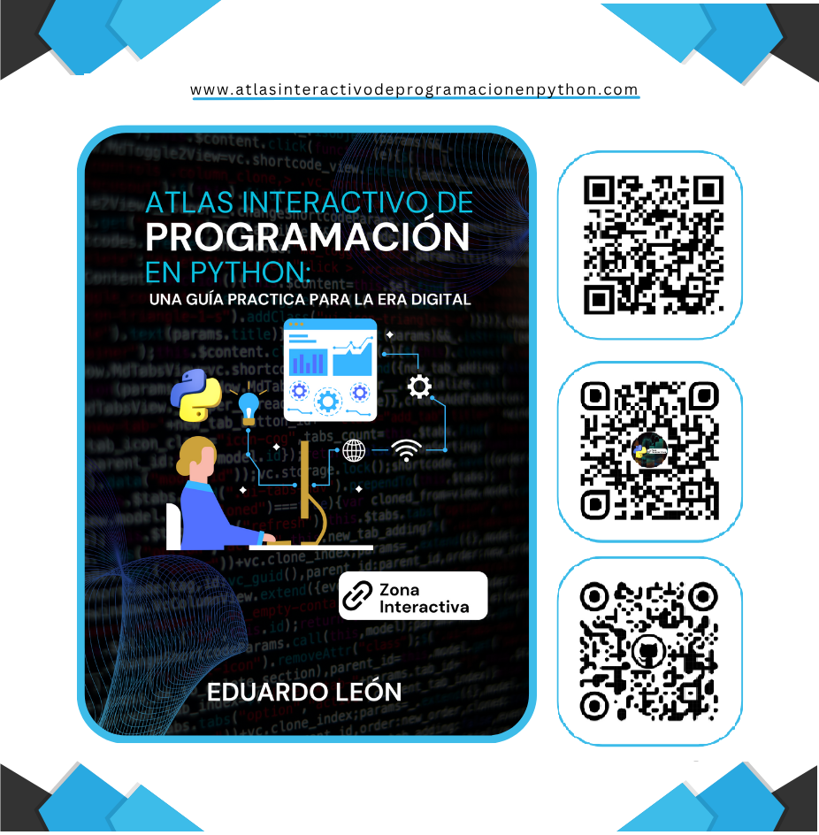

<h1 align="center"> Atlas Interactivo de Programacion en Python</h1>

  

Aprende Python desde cero hasta avanzado con nuestra guía interactiva GRATUITA</strong> 
  <em>13 secciones, ejercicios prácticos, proyectos reales y contenido actualizado.</em>

**¿Qué obtendrás?**
<ul>
  ✅ Aprende Python desde lo básico hasta nivel avanzado

  ✅ Ejercicios prácticos con soluciones detalladas
  
  ✅ Proyectos reales para tu portafolio
  
  ✅ Contenido visual e interactivo
  
  ✅ Basado en Python 3.10+
</ul>

 <h4 align="center"> ¡Descarga tu Atlas GRATIS! 📥</h4>

  

**¿Por qué este Atlas es diferente?**

  ✅ Diseñado para autodidactas | ✅ Ejemplos claros | ✅ Comunidad activa

**Vista previa**

  

**Política de privacidad**

  

  Consulta cómo protegemos y usamos tu información en nuestra
  <a href="doc/politicas-privacidad.md">Política de Privacidad</a>.

**Contacto**

  ¿Tienes dudas? Escríbenos a: 
  📧 <strong>servicionexatech@gmail.com</strong>

**Visítanos**

  

<strong>© 2025 NexaTech. Todos los derechos reservados.</strong>

